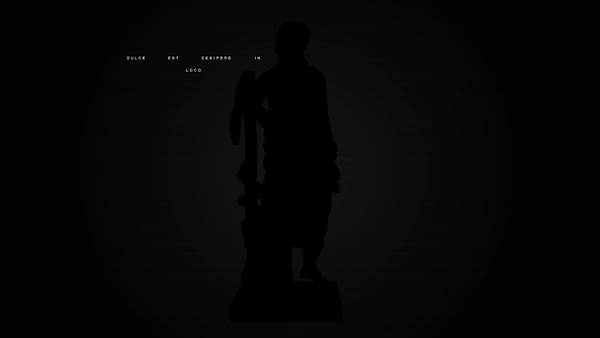

# Three JS 
Three js is one of my favourite js 3D library, and I have been using it for creative coding for some time now. 
Some time ago I tried to make some sort of sculpture showcase animation. This is the result of that experiement.
The idea was to create an interactive background for a website.

